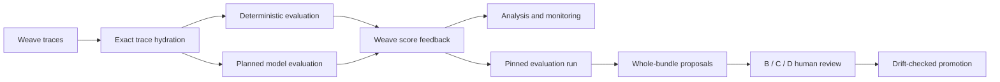

# Monopole design

Monopole turns agent traces recorded by `weave-agent-adapter` into an
auditable improvement loop. It evaluates observed outcomes and process quality,
finds regressions, proposes repository instruction changes, and requires a human
decision before promotion.

## Product model



Three systems hold different kinds of authority:

- Weave is the source of truth for recorded traces and attached scores.
- Local SQLite is the source of truth for evaluation-run inputs, progress,
  immutable review evidence, decisions, and promotion receipts.
- Repository Markdown files are the live instruction state and the promotion
  target.

The CLI provides direct scoring, judging, analysis, monitoring, inspection, and
proposal preview. The local web product owns durable evaluation runs, proposal
editing, promotion, and audit receipts.

The implementation follows those product boundaries. External trace access,
evaluation, analysis, and the durable run lifecycle are separate backend areas;
HTTP routes translate requests into them rather than owning their rules. The
frontend likewise keeps run execution and reflection review as feature areas,
while pages compose those features into user workflows.

## Evaluation model

Evaluation is layered:

1. Weave I/O discovers turn roots, hydrates exact traces, builds turn and
   session views, and writes score feedback to exact refs.
2. Deterministic evaluation extracts high-precision outcome and process signals
   without inference.
3. Model evaluation pins a bounded sliding-window plan, gives every session turn
   raw coverage, merges each reviewer's window findings into session scores and
   behavioral feedback, and retains every inference step and reviewer attempt.
4. Analysis admits only complete, context-compatible session judgments before
   comparing configurations or trends.
5. Evaluation runs pin their cohort and configuration, score and judge it, then
   evaluate complete instruction-bundle proposals.
6. Human review compares Past B, evaluated proposal C, and optional unevaluated
   edit D before a drift-checked promotion.

Every persisted rating is a boolean or finite number in `[0, 1]`, and higher
always means better. Harmful raw measures such as correction density or
abandonment remain explanatory metadata; their persisted scores are
correction-free rate and completion. A score describes evidence available in
the retained trace. It does not prove causality, and a whole-bundle proposal
score cannot be divided into causal per-file scores.

## Evaluation-run lifecycle

```text
created -> scoring -> judging -> reflecting -> complete
             \          \           \
              +----------+-----------+-> failed | cancelled
```

Selection and configuration are editable only while a run is created. Starting
pins the exact trace cohort, evaluator configuration, rubric and model catalogs,
and one compatible pipeline version. Every stage rehydrates the pinned
identities and fails closed if evidence or configuration no longer matches.

Reflection pins the feedback it consumed, captures exact Past B, evaluates B
and generated candidates, and initializes immutable review evidence. Review is
separate from pipeline status. The user may select an evaluated C, edit its
contents as unevaluated D, promote, or dismiss. D requires explicit
acknowledgement but not another inference run. A later evaluation run can assess
the promoted state.

The correctness mechanisms are deliberately stronger than the local deployment
model: pinned inputs and judging context policy, exhaustive raw-turn coverage,
content-authenticated resumable artifacts, reviewer-attempt audit, stage success
markers, cancellation coordination, compare-and-swap review revisions,
whole-scope drift detection, journaled multi-file promotion, rollback/recovery,
and monotonic progress are required.

## Trust boundaries and limits

- The local API is unauthenticated, binds to loopback by default, and is
  intended for one trusted user. A non-loopback bind is an explicit exposure of
  that trust boundary.
- Judge and proposal subprocesses receive only the minimum runtime and stored
  credential locations. Unsupported local backends fail closed when equivalent
  confinement cannot be established.
- Deterministic parsers favor precision and cannot recover evidence omitted by
  the adapter or fully interpret arbitrary shell programs.
- Model judgments are opinions over bounded evidence. Sliding windows prevent a
  long session from being silently reduced to a prefix, but reviewer-generated
  digests and merges can still omit, distort, or overweight evidence. There is
  no human-labeled calibration set, held-out validation gate, or claim that the
  context budget or review heuristics are statistically optimal.
- Reflection evaluates complete Markdown bundle revisions. The project-file
  adapter is the only promotion adapter today.
- The frontend polls persisted state; there is no raw-log or streaming endpoint.
- Standalone `reflect` previews proposals and never mutates managed files.

## Current-contract policy

This is a pre-release, current-contract-only product. Removed routes, payloads,
frontend surfaces, SQLite schemas, and stored local run rows are not supported.
The local run database is disposable, and discarding it also discards local run
and receipt history. Optional Git metadata is supporting context, not a required
or complete archive.

These specifications define product intent, observable behavior, boundaries,
invariants, tradeoffs, and current architecture. Source, CLI help, OpenAPI, and
tests remain the authority for lower-level implementation and interface detail.
